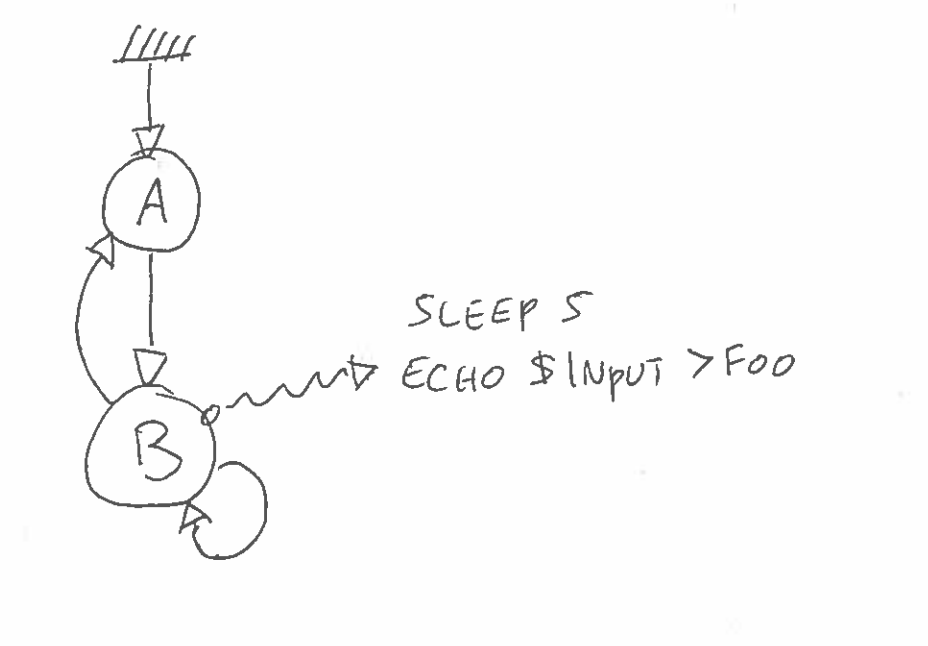

Automaton
============

Introduction
_______________

Overview
********

*Automaton* is a small Python_ tool that implements a finite state machine running
shell scripts. It is easy configured via a YAML manifest and will implement whatever
lifecycle you wish to enforce. The tool will install itself under */usr/local/bin*.

*Automaton* will flow from state to state and run a user-defined script at each transition.
When starting *Automaton* will setup a unix socket and listen for commands. Commands
include *STATE* which will return the current state and *GOTO* which trips the machine and
request to transition into another state.

Getting started
***************

Write a first simple YAML manifest called *bot.yml* with two states *A* and *B*. *A* can
switch to *B* and *B* will pause for 5 seconds and write to a local *foo* file. Note
*B* can transition to itself but not *A*.

The YAML manifest will for instance look like:

.. code-block:: YAML

    initial: A
    states:
    - tag: A
      shell: echo A
      next: 
        - B
    - tag: B
      shell: |
        sleep 5
        echo $INPUT > foo
      next: 
        - A
        - B

Each block in the *states* array must contain the state tag, a valid shell snippet and what 
transitions are allowed via the *next* array. Please note you can use a glob pattern and that
not specifying anything means the state is final.

Simply run *Automaton* on the command line and specify our YAML manifest and the name of
the socket to create:

.. code-block:: shell

    $ automaton bot.yml -d -s /tmp/sock

The machine will start and automatically switch to its initial state. You can test it is now
in the *A* state by using socat to write to the socket:

.. code-block:: shell

    $ echo STATE | socat - /tmp/sock
    A

Now let's trip it to the B state. After 5 seconds you should be able to see that *foo* file.

.. code-block:: shell

    $echo GOTO B | socat - /tmp/sock
    $ls -s foo
    0 foo

Since *B* can transition to itself let's trip again but this time we'll specify some input
payload. What's echoed to the socat after the state will be passed down verbatim to the shell
script as the **$INPUT** environment variable. For instance:

.. code-block:: shell

    $echo GOTO B hello | socat - /tmp/sock
    $cat foo
    hello

.. include:: links.rst