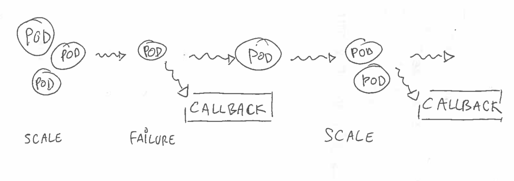

Introduction
============

Overview
________

Kontrol is a small Python_ package which implements a REST/HTTP endpoint plus a set of
Pykka_ state-machines. It is used to report periodic keepalive messages from a set of
pods and aggregate them in Etcd_.

The goal is to detect any change within this set of pods and react to it via a user-defined
callback. This callback is provided the ordered list of all participating pods with details
such as their IPv4 address and so on.

Kontrol is designed to address a few common use cases: passive monitoring and alerting,
distributed configuration or self-healing. You can use it in various topologies: separate
master & slave tiers, mixed mode (e.g self-managing pod ensemble) or even setup a chain of
masters (e.g monitoring the monitor).

System design
_____________

Kontrol operates in either slave, master or mixed mode. A **slave** will periodically emit a
keepalive payload to its **master** tier. This payload include information about the pod itself
plus some optional user-data. The masters will receive those keepalives and maintain a MD5 digest
reflecting the overall ensemble state. Any time this digest changes for whatever reason a
user defined callback is executed. The masters are HA and will fail-over in case of problem. They
are typically run via a Kubernetes_ deployment fronted by a service. Any master can receive
keepalives but only one at any given is in charge of tracking the digest and executing the callback.

All the locking, leader election and persistence is done 100% in Etcd_.

.. figure:: png/schematic.png
   :align: center
   :width: 90%

Please note you can run in both **master**/**slave** meaning the same pod deployment can run its
own monitoring logic.

Pod ordering
____________

It is crucial to keep consistent ordering for the pods that are monitored. Kontrol does it by first
identifying pods using their base 62 shortened Kubernetes_ IPv4 address. A monotonic integer sequence
is also assigned to each pod the first time they emit a keepalive. This sequence counter is then
persisted as long as the pod is alive.

Action/Reaction
_______________

Kontrol also allows slaves to execute arbitrary commands on behalf of the master. This mechanism
is the primary way to actively control your pod ensemble. Those commands are run by the *kontrol*
user and anything written to the standard output is sent back to the master.

It is also important to note that the callback has the ability to persist its own user-data across
multiple invokations. This is critical to maintain consistent runtime information describing how
the overall system is evolving. A typical use-case would be to assign and track custom ids or to
be able to re-assign existing data to new pods.

.. include:: links.rst