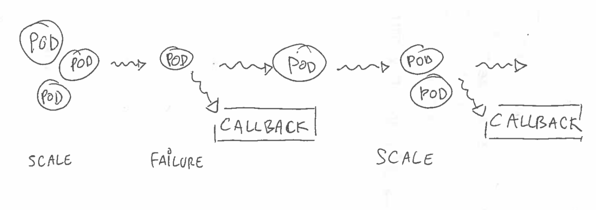
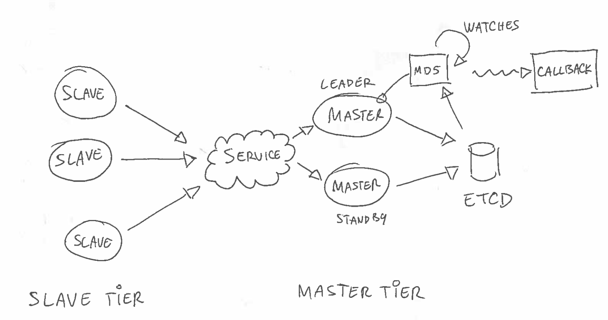

Kontrol
=======

Introduction
____________

Overview
********

*Kontrol* is a small Python_ package which implements a REST/HTTP endpoint plus a set of
Pykka_ state-machines. It is used to report periodic keepalive messages from a set of
pods and aggregate them in Etcd_.

The goal is to detect any change within this set of pods and react to it via a user-defined
callback. This callback is provided the ordered list of all participating pods with details
such as their IPv4 address and so on.

Kontrol is designed to address a few common use cases: passive monitoring and alerting,
distributed configuration or self-healing. You can use it in various topologies: separate
master & slave tiers, mixed mode (e.g self-managing pod ensemble) or even setup a chain of
masters (e.g monitoring the monitor).

System design
*************

Kontrol operates in either slave, master or mixed mode. A **slave** will periodically emit a
keepalive payload to its **master** tier. This payload include information about the pod itself
plus some optional user-data. The masters will receive those keepalives and maintain a MD5 digest
reflecting the overall ensemble state. Any time this digest changes for whatever reason a
user defined callback is executed. The masters are HA and will fail-over in case of problem. They
are typically run via a Kubernetes_ deployment fronted by a service. Any master can receive
keepalives but only one at any given is in charge of tracking the digest and executing the callback.

All the locking, leader election and persistence is done 100% in Etcd_.

Please note you can run in both **master**/**slave** meaning the same pod deployment can run its
own monitoring logic.

Pod ordering
************

It is crucial to keep consistent ordering for the pods that are monitored. Kontrol does it by first
identifying pods using their base 62 shortened Kubernetes_ IPv4 address. A monotonic integer sequence
is also assigned to each pod the first time they emit a keepalive. This sequence counter is then
persisted as long as the pod is alive.

Action/Reaction
***************

Kontrol also allows slaves to execute arbitrary commands on behalf of the master. This mechanism
is the primary way to actively control your pod ensemble. Those commands are run by the *kontrol*
user and anything written to the standard output is sent back to the master.

It is also important to note that the callback has the ability to persist its own user-data across
multiple invokations. This is critical to maintain consistent runtime information describing how
the overall system is evolving. A typical use-case would be to assign and track custom ids or to
be able to re-assign existing data to new pods.

Telemetry
*********

You also have the option to relay arbitrary json data in the keepalive requests that are emitted
periodically. This is done by directing Kontrol to use a json file on disk. Any update to this file
will be reflected in the overall pod snapshot and trigger a callback.

Configuration
_____________

Environment variables
*********************

Kontrol is configured via a few environments variables. Those are mostly defaulted based on what
the Kubernetes_ pod provides. A few can be specified in the manifest.

- **$KONTROL_HOST**: IPv4 address for the kube proxy (defaulted).
- **$KONTROL_IP**: IPv4 address for the pod (defaulted).
- **$KONTROL_ETCD**: IPv4 address for a Etcd_ proxy (defaulted).
- **$KONTROL_LABELS**: pod's label dictionary (defaulted).
- **$KONTROL_MODE**: pod operating mode, see below (defaulted).
- **$KONTROL_DAMPER**: reactivity damper (defaulted).
- **$KONTROL_TTL**: pod keepalive cutoff (defaulted).
- **$KONTROL_CALLBACK**: executable to run upon callback (optional).
- **$KONTROL_PAYLOAD**: local json file on disk to add to the keepalives (optional).

The labels are picked for you from the Kubernetes_ pod metadata. However you **must** at least
define the **app* and **role** labels as they are used by Kontrol.

Operating mode
**************

Kontrol can run in different modes. The **$KONTROL_MODE** variable is a comma separated list of tokens
indicating what underlying actors to run. Valid token values include *slave*, *master*, *debug* and *verbose*.
The default value is set to *slave* meaning that Kontrol will just attempt to report keepalive messages.
Specifying *master* will enable receiving keepalives and tracking the MD5 digest. Please note you can
specify both *master* and *slave* at the same time.

The *verbose* token will turn debug logs on. Those are piped to the container standard output.

Adding *debug* will allow to run in local debugging mode. In that case *slave* and *master* will be added
as well and **$KONTROL_HOST** used for both the pod IPv4 and Etcd_. In other words you can run a self contained
master/slave instance of your Kontrol image by doing:

.. code-block:: shell

    $ sudo ifconfig lo0 alias 172.16.123.1
    $ docker run -e KONTROL_MODE=debug -e KONTROL_HOST=172.16.123.1 -p 8000:8000 <image>

Please note this assumes you have a local Etcd_ running on your local host and listening on all interfaces.

Etcd
****

The **$KONTROL_ETCD** variable is defaulted to the kube proxy IPv4. This assumes the Etcd_ proxy running in there
is listening on all interfaces. If you want to use a dedicated Etcd_ proxy you can override this variable.

Pod payload 
***********

Slaves have the ability to include arbirary json payload in their keepalives. Simply set the **$KONTROL_PAYLOAD**
variable to point to a file on disk containing valid serialized JSON. This content will be parsed and included
in the keepalive request.

If the variable is not set or if the file does not exist or contains invalid JSON this process will be skipped.

Callback
********

Kontrol will periodically run a user-defined callback whenever a change is detected. This callback is an
arbitrary command you can specify via the **$KONTROL_CALLBACK** variable. This subprocess is tracked and its
standard error and output piped back. It does not have to be a shell or Python_ script or anything
specific for that matter. The only requirement is to have it set to a valid command.

The callback sub-process will be passed 3 environment variables:

- **$HASH**: latest MD5 digest.
- **$PODS**: ordered list of pods as a JSON array.
- **$STATE**: optional user-data.

The **$PODS** variable contains a snapshot of the current pod ensemble. It is passed as a serialized JSON
array whose entries are consistently ordered. Anything written on the standard output is assumed to be
valid JSON syntax, will be persisted in Etcd_ and passed back upon the next invokation as the **$STATE**
variable.

Each entry in the **$POD** array is a small dict containing a few fields. For instance:

.. code-block:: json

    {
        "ip": 172.16.123.1
        "seq": 3
        "uuid": "redis-39mysN"
        "role": "redis"
        "payload": {"some": "stuff"}
    }

The UUID and sequence counter are guaranteed to be unique amongst all the monitored pods. The payload field is
optional and set if the slaves have **$KONTROL_PAYLOAD** set.

The following Python_ callback script will for instance display the UUID and IPv4 address assigned to each pod:

.. code-block:: python

    #!/usr/bin/python

    import os
    import sys
    import json

    if __name__ == '__main__':

        for pod in json.loads(os.environ['PODS']):
            print >> sys.stderr, ' - #%d (%s) -> %s' % (pod['seq'], pod['uuid'], pod['ip'])

.. include:: links.rst